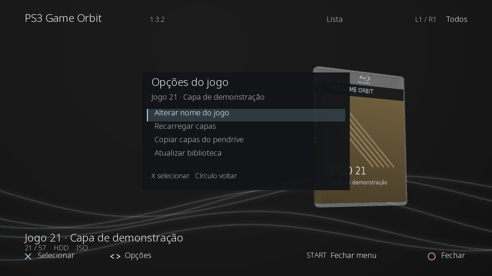

# PS3 Game Orbit


**v1.3.2-rc.1 — criado por SpeedVash.** Biblioteca de jogos PS3 com caixas 3D, capas completas, layouts Clássico/Spine/Lista, favoritos e montagem pelo webMAN MOD.



*Preview no computador com a geometria, matrizes, texturas e interface do código nativo. Não é uma captura do PS3; as artes são demonstrativas.*

## Novidades da 1.3.2

- Atualização parcial da interface: cabeçalho, rodapé, painel e linhas da Lista só são redesenhados e enviados quando mudam. A textura da interface permanece alocada.
- Decodificadores PNG/JPEG permanecem carregados. Imagens de até 1024 pixels por lado, sem rotação necessária, seguem diretamente em ARGB para upload, evitando a conversão dupla de canais.
- Log em lotes: buffer de até 64 KiB, gravado em repouso a intervalos mínimos de três segundos e ao encerrar. Navegação e animação de abertura adiam a gravação.
- Medições em milissegundos de leitura, decodificação, upload e atualização da interface, com quantidade, total, média e máximo no log.
- **Caches mantidos em 15 capas / 15 interiores / 15 discos**, independentes, com os mesmos limites de memória.
- Primeira tela com **v1.3.2 e Criado por SpeedVash**. SELECT contém somente controles; nomes de imagens e detalhes de cache ficam nesta documentação.
- Arte PNG do disco continua pela região central antes sem textura, até o furo físico de 15 mm. Geometria original de 1.056 triângulos, plástico neutro da caixa e UVs da capa permanecem preservados.
- **START abre um menu do jogo**: alterar nome, recarregar capas, importar três imagens do pendrive ou atualizar a biblioteca. O menu funciona com a caixa aberta ou fechada.

## Instalação

1. Copie `PS3_GAME_ORBIT_v1.3.2_TESTE.gnpdrm.pkg` para um pendrive FAT32 e instale no gerenciador de pacotes do XMB, por cima da 1.3.1.
2. O aplicativo mantém `PGORBT301` e suas preferências. Em Super Slim, habilite o HEN antes de abrir. Mantenha o webMAN MOD ativo.
3. Quadrado alterna os três layouts; L3 abre/fecha a caixa. X monta o jogo, aberto ou fechado, e volta ao XMB após confirmar o disco. Abra o jogo pelo ícone do disco no XMB.

Compilação e testes no computador concluídos. **O teste físico desta v1.3.2 no PS3 está pendente.** A primeira leitura continua síncrona; as otimizações não prometem eliminar toda pausa no console.

## Menu START

| Opção | Comportamento |
| --- | --- |
| Alterar nome | Abre o teclado do PS3. Salva o nome exibido no Game Orbit; não altera pasta, ISO, PARAM.SFO, ID ou nomes de capas. Cancele no teclado para manter o anterior. |
| Recarregar capas | Relê capa exterior, Inside Cover Full e disco somente do jogo selecionado, incluindo tentativas que falharam. Preserva os outros jogos nos caches. |
| Copiar capas do pendrive | Confere, copia e recarrega as três imagens do jogo reconhecido pela ID. |
| Atualizar biblioteca | Reescaneia jogos e limpa os três caches. Mantém nomes salvos, favoritos e preferências. |

Cima/baixo escolhem a opção, X confirma, Círculo ou START fecham o menu. Durante uma operação, a seleção fica bloqueada. Se não houver jogo selecionado, START faz a releitura da biblioteca.

## Atualizar imagens por pendrive

Coloque **as três imagens na raiz do mesmo pendrive FAT32**, usando a ID reconhecida do jogo:

```text
BLES01287.jpg
BLES01287_INSIDE.jpg
BLES01287_DISC.png
```

Selecione o jogo e use **START → Copiar capas do pendrive**. O aplicativo procura em `/dev_usb000` até `/dev_usb007`, valida a decodificação das três imagens e copia para **`/dev_hdd0/PS3COVERS`**. Depois invalida e recarrega somente as imagens do jogo escolhido. Quando há formatos antigos concorrentes com a mesma ID/sufixo, eles são substituídos para que a nova arte tenha prioridade.

A cópia exige o trio completo, a extensão e as maiúsculas exatamente como no exemplo, e uma TITLE_ID conhecida. Imagem faltando ou corrompida cancela a atualização e preserva as capas atuais. Um erro ao substituir arquivos tenta restaurar os anteriores. Para ISO sem ID reconhecida no nome, copie as imagens manualmente pelo nome exato do ISO, como explicado abaixo, e escolha Recarregar capas.

## Nomes das imagens: jogos em pasta e ISO

Pasta principal: **`/dev_hdd0/PS3COVERS`**. Para jogos em pasta com TITLE_ID conhecido, use a ID. **Para ISO, a ID interna ainda não é lida:** o scanner só identifica uma ID que esteja no nome do arquivo, com quatro letras e cinco números juntos, como `BLES01287` (sem hífen).

Se o arquivo for **`Bayonetta.iso`**, use exatamente **`Bayonetta`** nos nomes das imagens, preservando espaços, sublinhados e maiúsculas/minúsculas do arquivo:

| Imagem | Para `Bayonetta.iso`, sem ID no nome | Com TITLE_ID reconhecido |
| --- | --- | --- |
| Capa exterior completa | `Bayonetta.jpg` | `BLES01287.jpg` |
| Inside Cover Full | `Bayonetta_INSIDE.jpg` | `BLES01287_INSIDE.jpg` |
| Rótulo do disco | `Bayonetta_DISC.png` | `BLES01287_DISC.png` |

**Uma capa nomeada apenas pela ID não é encontrada para um ISO cujo nome não contenha essa ID.** Não é obrigatório renomear o ISO: use o nome exato dele para as três imagens. A prioridade de busca é ID reconhecida na pasta global, nome exato do ISO/pasta na pasta global, depois nome exato ao lado do ISO. Artes internas e de disco também têm fallback dentro da pasta do jogo.

JPG, JPEG e PNG são aceitos, inclusive extensões maiúsculas. Os sufixos são **`_INSIDE`** e **`_DISC`**, em maiúsculas. Para inside/disc, PNG tem preferência quando há vários formatos com o mesmo nome.

A capa exterior é uma imagem inteira em ordem **verso · lombada · frente**. O inside é uma imagem inteira em ordem **interior esquerdo · centro/lombada · interior direito**, sem espelhar. O mapeamento da tampa orienta os dois lados ao abrir. O centro ocupa aproximadamente 46,22% a 53,79% da largura. Há um [modelo de 1000 × 535](assets/examples/INSIDE_COVER_FULL_MODELO_1000x535.png) e um [exemplo identificado](assets/examples/INSIDE_COVER_FULL_EXEMPLO.png).

Use capas exterior/interior com cerca de **1000 pixels de largura** e disco com **512 × 512**. A arte de disco pode ser quadrada: a geometria recorta contorno circular e furo central. O importador respeita EXIF e normaliza capas completas verticais automaticamente. Sem inside válido, o interior fica neutro; sem arte válida do disco, aparece o rótulo padrão. Isso não impede a montagem.

Após substituir imagens manualmente, use **START → Recarregar capas** no jogo selecionado. A recarga relê os caminhos e invalida somente as três imagens desse jogo, preservando as demais entradas dos caches. A orientação de nomes e memória fica neste README; SELECT apresenta apenas controles.

## Controles

| Controle | Ação |
| --- | --- |
| Esquerda/direita ou analógico esquerdo | Trocar jogo |
| Cima/baixo ou analógico esquerdo vertical, na Lista | Trocar linha |
| Quadrado | Clássico / Spine / Lista |
| L3 | Abrir / fechar caixa e disco |
| X, caixa aberta ou fechada | Montar pelo webMAN MOD; voltar ao XMB após confirmação |
| Círculo, caixa aberta e sem montagem | Recolher disco e fechar caixa |
| Círculo, durante montagem | Cancelar operação e sair ao XMB |
| Círculo, caixa fechada | Sair ao XMB |
| Analógico direito | Girar / inclinar caixa |
| Triângulo | Marcar / remover favorito |
| L1 / R1 | Todos / HDD / USB / Favoritos |
| Cima, no Clássico ou Spine | Ativar / pausar autogiro |
| L2 / R2 | Zoom |
| R3 | Restaurar posição e zoom mínimo |
| SELECT | Abrir / fechar ajuda de controles |
| START | Abrir / fechar opções do jogo |

Durante a inspeção, navegação, filtros, layout e favoritos ficam bloqueados. X monta e START abre o menu do mesmo jogo. Dentro do menu, X confirma a opção e Círculo fecha o menu. Durante montagem, um segundo X não cria outra solicitação.

## Memória e desempenho

Os três caches guardam até 15 texturas válidas por tipo, por ordem de uso recente. Capas exteriores são carregadas para a visualização e prefetch; interiores e discos são carregados ao abrir a caixa e permanecem residentes ao fechar ou trocar de jogo.

Cada cache tem limite de **64 MiB**, sem exceção ao teto de 15 entradas. O cache de arquivos codificados das capas mantém 15 entradas / 16 MiB. Uma textura de 1024 × 1024 usa cerca de 4 MiB; 15 usam 60 MiB. O limite combinado dos três caches é 192 MiB; arquivos codificados, decodificação temporária, geometria, HUD e vídeo usam memória adicional. Imagens de aproximadamente 1000 pixels de largura e discos de 512 pixels reduzem o custo inicial.

As texturas são limitadas a 1024 pixels por lado depois da decodificação. Imagens com mais de 16 milhões de pixels ou 8192 pixels por lado são rejeitadas. Imagens opcionais inválidas não ocupam textura. Recarregar capas limpa apenas o jogo; Atualizar biblioteca ou encerrar limpa todos os caches. Não há cache persistente nem miniaturas em disco.

O prefetch de capas aguarda 400 ms de repouso, prepara no máximo uma capa a cada 200 ms e alcança até sete vizinhos de cada lado. Ele pausa com o menu aberto. Recursos são preparados entre quadros confirmados. Leituras, decodificação e upload iniciais continuam síncronos; voltar às artes residentes evita esse trabalho.

## Medições e diagnóstico

Log principal: **`/dev_hdd0/tmp/PS3_GAME_ORBIT_FIX35.log`**; fallback em `/dev_hdd0/game/PGORBT301/USRDIR/`.

Procure linhas iniciadas por `PERF 1.3.2`:

| stage | Escopo |
| --- | --- |
| read | Abrir/ler arquivo de imagem e identificar seu cabeçalho. Acerto no cache não lê de novo. |
| decode | Decodificação PNG/JPEG e cópia do resultado do decodificador. |
| upload | Preparação da textura: orientação/redução quando necessárias, alocação, cópia e mapeamento na memória RSX. Não mede conclusão do processamento da GPU. |
| interface | Redesenho das regiões alteradas e cópia parcial para a textura da interface. Quadros sem alteração não entram no contador. |

Cada linha mostra `count`, `total_ms`, `average_ms` e `max_ms`, acumulados desde a abertura do aplicativo. O relógio nativo tem unidade em microssegundos; os valores são convertidos para milissegundos. As etapas são medidas separadamente e não representam o tempo completo de um quadro. O resumo ocorre periodicamente e ao sair; a gravação espera repouso ou encerramento.

Estado: `/dev_hdd0/tmp/PS3_GAME_ORBIT_STATE.dat`; layout: `PS3_GAME_ORBIT_LAYOUT.dat`; nomes personalizados: `PS3_GAME_ORBIT_NAMES.dat`. Os três têm fallback no USRDIR do aplicativo.

## Fontes, testes e créditos

Veja [TESTE_1.3.2.md](docs/TESTE_1.3.2.md), [VALIDATION.md](docs/VALIDATION.md), [BUILD.md](docs/BUILD.md), [CHANGELOG.md](CHANGELOG.md) e [CREDITS.md](CREDITS.md).

O scanner lê `GAMES`, `GAMEZ` e `PS3ISO` no HDD e USB 000–007. HTTP local do webMAN na porta 80; interface 1280 × 720. NTFS, rede e leitura do PARAM.SFO dentro de ISOs não foram adicionados nesta versão.

O ZIP contém os fontes públicos, ativos próprios, PKG e relatórios. Obtenha o modelo JFX separadamente para compilar: OBJ/PSD e sua malha editável derivada são excluídos dos fontes públicos. Os testes públicos usam uma malha de teste e o workflow não publica releases automaticamente.
