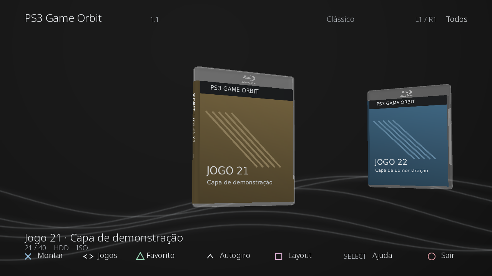
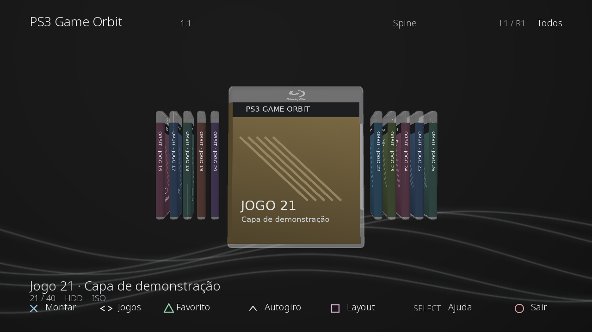

# PS3 Game Orbit

**1.1.0-rc.1 — atualização de teste com layouts Clássico e Spine.**

Biblioteca de jogos PS3 com caixas 3D, capas completas, favoritos e montagem pelo webMAN MOD. Esta atualização reduz as caixas do layout padrão ao zoom mínimo da versão 1.0 e anima a saída e a entrada das capas durante a navegação.

*Prévias geradas no computador com a geometria e as posições exportadas do código nativo. As capas são demonstrativas; as imagens não são capturas de um PS3.*

## O que mudou

- Layout **Clássico** com duas caixas no tamanho padrão `0,55`, o mínimo do zoom anterior. R3 também retorna a `0,55`.
- Troca de jogos com movimento e desaparecimento gradual da caixa anterior, entrada da próxima e continuidade ao inverter a direção.
- Layout **Spine**, adaptado do “Spine by Phoenix” do Aurora: cinco lombadas de cada lado e a capa selecionada à frente.
- **Quadrado** alterna os layouts. A escolha é salva para a próxima abertura.
- Barra de controles e ajuda atualizadas.

A versão 1.0 foi aprovada pelo usuário em um Slim com CFW. **Esta build 1.1 ainda precisa de teste no console**; compilação e testes no computador passaram.

## Download e instalação

Use `PS3_GAME_ORBIT_v1.1_TESTE.gnpdrm.pkg`, fornecido junto dos fontes ou anexado à release de teste.

1. Copie o PKG para um pendrive FAT32.
2. Instale pelo gerenciador de pacotes do XMB **por cima da 1.0**. O aplicativo mantém o TITLE_ID `PGORBT301`; a versão SFO passa a `01.01`.
3. Abra **PS3 Game Orbit**. O layout Clássico é o padrão na primeira execução.
4. Pressione **Quadrado** para alternar para Spine.
5. Com webMAN MOD ativo, pressione **X** para montar o jogo. Depois de confirmar o TITLE_ID esperado do disco, o aplicativo volta ao XMB; abra o jogo pelo ícone do disco.

Os favoritos, filtro e seleção continuam usando o arquivo da 1.0. Não é necessário apagá-lo para instalar a atualização.

## Controles

| Controle | Ação |
| --- | --- |
| Esquerda/direita ou analógico esquerdo | Selecionar jogo |
| Quadrado | Alternar Clássico / Spine |
| X | Montar pelo webMAN MOD |
| Triângulo | Marcar/remover favorito |
| L1/R1 | Alternar Todos, HDD, USB e Favoritos |
| Analógico direito | Girar e inclinar a caixa selecionada |
| Cima no direcional | Ativar/pausar giro automático |
| L2/R2 | Aproximar/afastar entre 0,55 e 0,80 |
| R3 | Restaurar posição frontal do layout e zoom 0,55 |
| SELECT | Abrir/fechar ajuda |
| START | Atualizar a biblioteca |
| Círculo | Voltar ao XMB |

Durante a montagem, seleção, layout e releitura da biblioteca ficam bloqueados. Círculo continua disponível para sair.

## Capas e biblioteca

Capas completas JPG/PNG vão em `/dev_hdd0/PS3COVERS`, com o TITLE_ID como nome, por exemplo `BLES01287.jpg`. A imagem deve conter **verso | lombada | frente**, nessa ordem. A lombada fica no centro da imagem. A orientação normal é automática, com EXIF e normalização de capas completas verticais. Imagens exclusivamente frontais aparecem apenas na frente.

Jogos são encontrados em `GAMES`, `GAMEZ` e `PS3ISO` do HDD ou de `/dev_usb000` a `/dev_usb007`. O aplicativo usa o servidor HTTP local do webMAN MOD na porta 80 e renderiza a interface em 1280 × 720.

Spine é uma adaptação ao modelo PS3 e ao renderizador deste projeto. Usa onze jogos visíveis, sem repetir títulos em bibliotecas menores. Os reflexos de piso e as 81 colunas do layout original do Aurora não estão incluídos nesta build. As caixas continuam sendo o modelo JFX aprovado, com plástico transparente sem pigmento azul.

As capas são reduzidas proporcionalmente para uma textura de até 1024 pixels por lado, preservando a imagem completa e os UVs. O primeiro carregamento de capas novas ainda depende do tempo de leitura/decodificação no PS3.

## Preferências e diagnóstico

- Favoritos, filtro e seleção: `/dev_hdd0/tmp/PS3_GAME_ORBIT_STATE.dat`.
- Layout: `/dev_hdd0/tmp/PS3_GAME_ORBIT_LAYOUT.dat`.
- Log desta build: `/dev_hdd0/tmp/PS3_GAME_ORBIT_FIX31.log`.

Se esses caminhos não estiverem disponíveis, o aplicativo tenta os mesmos nomes em `/dev_hdd0/game/PGORBT301/USRDIR/`. O arquivo separado de layout preserva a compatibilidade do estado com a 1.0.

## Compatibilidade e validação

A base 1.0 foi testada pelo usuário em Slim com CFW. HEN/Super Slim e esta atualização 1.1 não foram validados fisicamente. Veja [VALIDATION.md](docs/VALIDATION.md) e [TESTE_1.1.md](docs/TESTE_1.1.md).

ISOs sem TITLE_ID conhecido não têm confirmação automática da montagem. NTFS, biblioteca de rede e leitura do PARAM.SFO dentro de ISOs continuam fora desta versão.

## Código e compilação

Leia [BUILD.md](docs/BUILD.md). O aplicativo usa C++17, PSL1GHT e a pilha ps3aqua/GCC 7.5.0 fixada por commit. O PKG pronto não exige o SDK.

Para compilar, obtenha o modelo JFX separadamente da página original e use o importador incluído. OBJ/PSD e geometria gerada em código não acompanham este repositório público, conforme os termos do ativo.

O GitHub Actions executa os testes de fluxo/layout, interface, inicialização e FIFO que dispensam o modelo. A compilação nativa e os testes do modelo/renderizador exigem prepará-lo localmente. O workflow não publica releases automaticamente.

Veja [CHANGELOG.md](CHANGELOG.md) e [CREDITS.md](CREDITS.md).
