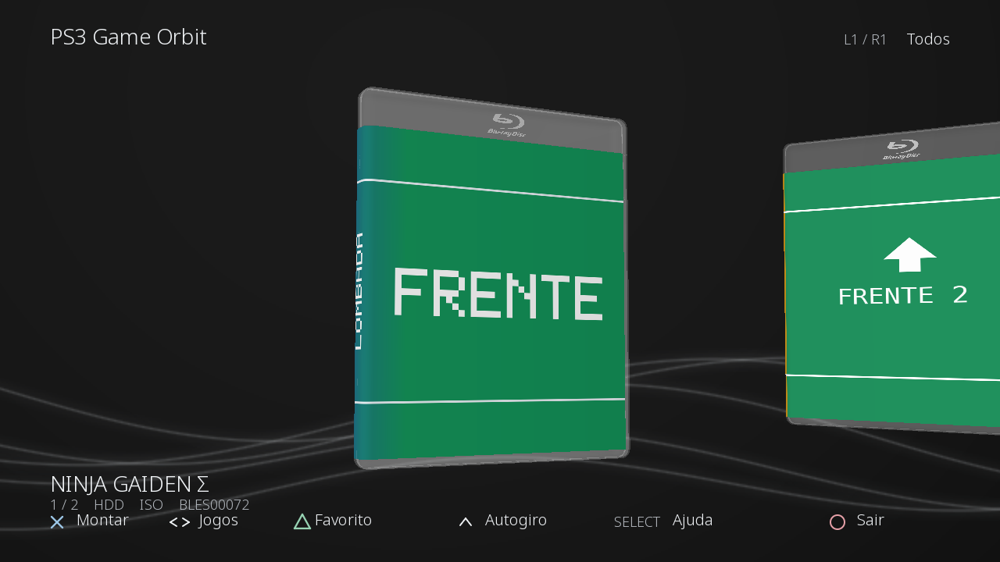

# PS3 Game Orbit


**Versão 1.0 — biblioteca de jogos PS3 com caixas 3D, capas completas e montagem pelo webMAN MOD.**

Gire a caixa para ver frente, lombada e verso, marque favoritos e navegue pelos jogos do HDD ou USB. A interface tem plástico transparente sem pigmento azul, fundo com ondas inspirado no XMB, fonte leve e ajuda compacta.



*Prévia gerada no computador a partir dos dados nativos, com capas de teste. Não é uma foto da saída do PS3.*

## Download e instalação

Baixe `PS3_GAME_ORBIT_v1.0.gnpdrm.pkg` na seção **Releases** deste repositório.

1. Tenha o webMAN MOD instalado e ativo no PS3.
2. Copie o PKG para um pendrive FAT32 e instale pelo gerenciador de pacotes do XMB.
3. Abra **PS3 Game Orbit** e selecione um jogo.
4. Pressione **X** para montar. Quando o disco com o ID esperado for confirmado, o aplicativo retorna ao XMB; inicie o jogo pelo ícone do disco.

O aplicativo usa o ID `PGORBT301` e a versão `01.00` no XMB. A release 1.0 preserva exatamente o instalador FIX30 aprovado; o nome do arquivo foi padronizado para publicação. Quem já instalou esse FIX30 já tem a mesma versão.

## Compatibilidade

- Interface aprovada pelo usuário em um PS3 Slim com CFW.
- webMAN MOD ativo, com o servidor HTTP local na porta 80.
- Saída da interface em 1280 × 720.
- Jogos em pastas ou ISOs nos diretórios `GAMES`, `GAMEZ` e `PS3ISO` do HDD ou de `/dev_usb000` a `/dev_usb007`.
- HEN/Super Slim não foi validado para esta release.

ISOs sem TITLE_ID conhecido não têm confirmação automática de montagem nesta versão. Nesse caso, confira o disco no XMB. NTFS, biblioteca de rede e leitura do PARAM.SFO de dentro de ISOs não estão implementados.

## Controles

| Controle | Ação |
| --- | --- |
| Esquerda/direita ou analógico esquerdo | Selecionar jogo |
| X | Montar pelo webMAN MOD |
| Triângulo | Marcar/remover favorito |
| L1/R1 | Alternar Todos, HDD, USB e Favoritos |
| Analógico direito | Girar e inclinar a caixa |
| Cima no direcional | Ativar/pausar giro automático |
| L2/R2 | Aproximar/afastar |
| R3 | Restaurar posição e zoom |
| SELECT | Abrir/fechar ajuda |
| START | Atualizar a biblioteca |
| Círculo | Voltar ao XMB |

## Capas

Coloque capas completas JPG ou PNG em `/dev_hdd0/PS3COVERS`, usando o TITLE_ID como nome, por exemplo `BLES01287.jpg`.

A imagem completa deve conter **verso | lombada | frente**, da esquerda para a direita. A lombada fica no centro. A orientação normal é automática, respeitando EXIF e normalizando capas completas verticais. Quando só existe uma imagem frontal, ela aparece apenas na frente da caixa.

O fundo com ondas é desenhado pelo aplicativo. A fonte usada é Noto Sans Light; os arquivos não são extraídos do sistema PS3.

## Preferências e diagnóstico

Favoritos, filtro e seleção ficam em `/dev_hdd0/tmp/PS3_GAME_ORBIT_STATE.dat`, com alternativa na pasta do aplicativo. O estado do FIX29 é importado na primeira execução quando necessário.

O identificador interno desta release continua sendo **FIX30**. O log fica em:

```text
/dev_hdd0/tmp/PS3_GAME_ORBIT_FIX30.log
```

Alternativa: `/dev_hdd0/game/PGORBT301/USRDIR/PS3_GAME_ORBIT_FIX30.log`. Ao relatar um problema, informe modelo do console, CFW/HEN, versão do webMAN e como reproduzir; revise os caminhos de jogos no log antes de anexá-lo.

## Código e compilação

Consulte [BUILD.md](docs/BUILD.md). O código nativo usa C++17, PSL1GHT e um SDK PPU ps3aqua com GCC 7.5.0, fixado por commit. O instalador pronto não exige essas ferramentas.

O modelo Blu-ray JFX precisa ser baixado separadamente da página original para compilar. Os arquivos OBJ/PSD e os dados de geometria gerados não são distribuídos neste repositório, conforme os termos do ativo. O importador e as verificações acompanham o projeto.

O GitHub Actions verifica a interface, a apresentação e o fluxo de comandos no computador, sem baixar o modelo. A compilação nativa e os demais testes são executados localmente depois de preparar o ativo.

Veja [CHANGELOG.md](CHANGELOG.md), [VALIDATION.md](docs/VALIDATION.md) e [CREDITS.md](CREDITS.md).
